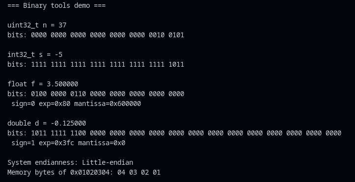

# Binary Tools: Inspecting Bits and Bytes in C


## Overview

This repository contains a C program (`ConvertToBinary.cpp`) that provides utility functions to inspect and print the binary representation of various data types, including unsigned and signed integers, floats, doubles, and memory bytes. It demonstrates key concepts like bitwise operations, two's complement, IEEE 754 floating-point representation, and endianness.

The tools are designed for educational purposes to help understand how data is represented at the bit level. The program includes a demo in `main()` that showcases examples for different types.

## Features

- Print binary bits of unsigned integers (with nibble grouping for readability).
- Handle unsigned and signed integers of various sizes (1, 2, 4, 8 bytes).
- Print raw bits of floats and doubles, including decoded sign, exponent, and mantissa.
- Detect system endianness (little-endian or big-endian).
- Print raw memory bytes to visualize endianness.
- Optional: Functions to find the highest set bit and count the number of set bits (popcount).

## Requirements

- C compiler (e.g., GCC with C11 standard).
- Standard libraries: `<iostream>`,`<string.h>`.

## Compilation and Execution

Compile the program using:

```bash
gcc -std=c11 -Wall -O2 -o ConvertToBinary ConvertToBinary.cpp
```

Run it:

```bash
./ConvertToBinary
```
## Example Output

Running the program on a little-endian system produces output similar to the following (actual bits may vary slightly based on system)



## Exercises and Drills
### TBD on revision, if at all

1. **Print lower 8 bits**: Modify `print_bits_u64` calls to print only 8 bits, e.g., for `uint32_t m = 513;` expect `0000 0001`.
2. **Trim leading zeros**: Use `highest_bit_index()` to print minimal bits (call `print_bits_u64(v, highest_bit_index(v) + 1)`).
3. **Popcount**: Test `popcount(0xF0F0)`; expect `8`.
4. **Endianness check**: Use `print_memory_bytes` on multi-byte values to confirm system endianness.
5. **Signed values**: Print `-5` for different signed sizes and verify two's complement.
6. **Floats**: Test simple floats like `1.0`, `0.5` and check sign/exp/mantissa.

## Notes and Gotchas

- The functions examine numeric values, not raw memory (use `print_memory_bytes` for that).
- Assumes little-endian fallback for non-standard sizes.
- `memcpy` is used for float/double bit access to avoid aliasing issues.
