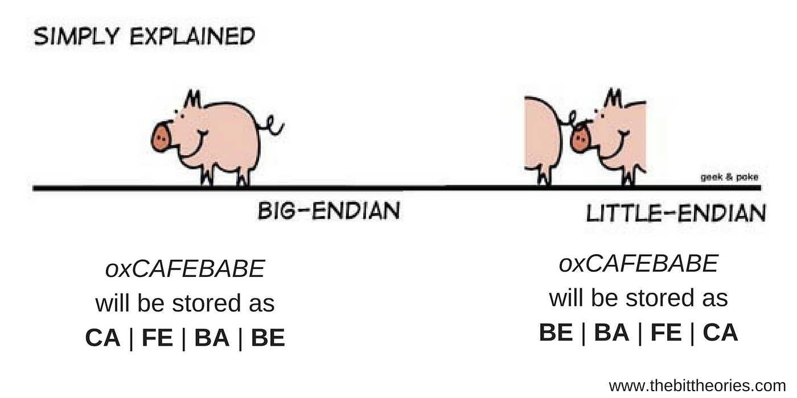

# Endianness Detection and Byte Swapping

This diagram illustrates the difference between little-endian and big-endian byte orders, showing how multi-byte values are stored in memory.

## Overview

This simple C++ program detects the system's endianness (little-endian or big-endian) and provides a generic function to swap byte order for any data type. It includes a demonstration in the `main` function using an unsigned integer.

## Usage

Compile and run the program using a C++ compiler (e.g., `g++ endianness.cpp -o endianness && ./endianness`). It will output the system's endianness and demonstrate swapping bytes for a sample value.

## Advanced Features (To Be Implemented Soon)

For deeper understanding, future updates will include:
- Handling floating-point byte order differences across architectures.
- Bit-level endianness in embedded protocols.
- Nested structs with padding-aware swapping.